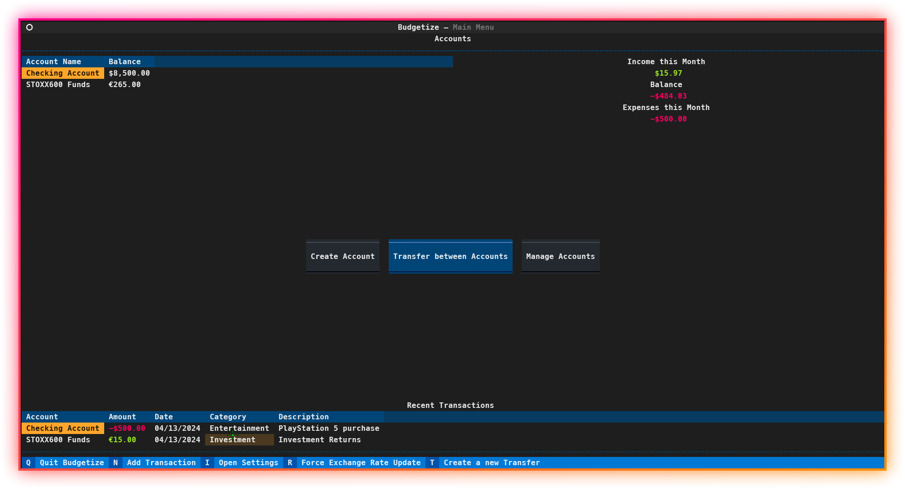

# Budgetize
A Terminal User Interface (TUI) that allows you to manage your finances made with Python.\


**✨ Features**
- Manage various accounts by adding income/expense transactions.
- Visualize your monthly balance
- Works with different currencies and automatically fetches exchange rates.



# ⚙ Installation

There is currently no compiled binaries (`.exe` files) to run Budgetize. Although there are plans in the future when the stable version is released.

For now, you can install Budgetize from PyPi with Python:
```bash
pip install budgetize
budgetize
```

To install the Bleeding Edge version (dev branch) run:
```
pip install git+https://github.com/fer-hnndz/budgetize.git@dev
budgetize
```

# ❓ Why Budgetize?

I have a long trajectory of testing out different "Money Manager Apps", all had one *little* problem: its usage on other devices.\
So I stepped up to the challange to create MY version of a Money Manager App, which would sync with an existing cloud service so I can access my data on any computer I had access to.\
I saw that this wasn't a UNIQUE idea but it was very useful. So I decided to launch it as an open source project.\
**Although there is still no support with it**, Budgetize aims to be a simple and lightweight Money Manager app that sync with the cloud so you can store your data safely and access it anywhere.

I'll add support in the future to sync your finances with Google Drive by providing an API key yourself.\
The compiled version will already be shipped with an existing API key to be ready to use.

# 🗺 Roadmap
You may check the project's roadmap in the open projects.\
[**Go To Projects**](https://github.com/fer-hnndz/budgetize/projects?query=is%3Aopen)

# Contributing

You may check the contributing guide [here](docs/CONTRIBUTING.md)

# License
Budgetize uses the [General Public License v3](LICENSE)

# 🔧 Built With
- [Textual](https://textual.textualize.io/) - TUI framework
- [SQLAlchemy](https://www.sqlalchemy.org/) - ORM toolkit to store user's data
